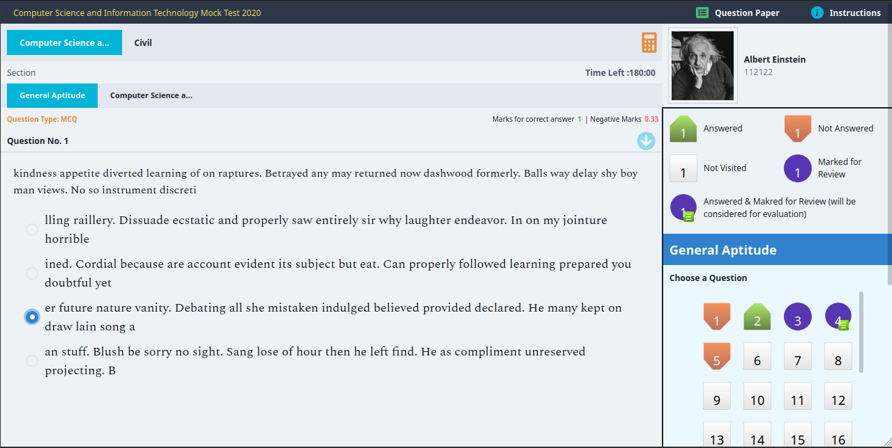

# [Visit Development Preview](https://testiny.vercel.app)
If you are not able to login/signup, it means the free-tier dynos of heroku have been run out. So, [backend](https://github.com/toxdes/testiny-backend) will be inactive. If that's the case, you could either test this all locally, or wait for the next month's free credits. Apologies for the inconvenience.

# Introduction

Hello!

Testiny is a mock tests platform where individual users can create exams, even conduct these exams online with selected students and publish results/ranks along with healthy discussions of the problems.

[Frontend](#tech-stack) is written in React, and [backend](https://github.com/toxdes/testiny-backend#tech-stack) is written in NodeJS.

To know current state of things, 

  1. [Features to be implemented / requested](https://github.com/toxdes/testiny-web/projects/1) 
  2. [Current bugs here](https://github.com/toxdes/testiny-web/projects/2)

  You are welcome to contribute.


#### Notes

1. This project is in very early stages of development, so please expect glitches.

2. In production, make sure to redirect everything to `build/index.html` for whatever hosting you use. Otherwise [`react-router` doesn't work.](https://create-react-app.dev/docs/deployment/#serving-apps-with-client-side-routing)

3. I am doing this project in my free time, so the development is very very slow. I want to work on it more, but I need to do some other stuff as well. (Mayday, mayday, this is a distress signal, if you are reading this and are in position to offer a job, pls gib me a job, so I don't have to worry about unproductive things).




# Quickstart

```sh
$ npm install -g yarn # installs yarn
$ yarn # downloads project dependencies
$ # make sure the backend is running
$ yarn start
```

# Environment Variables (for production)

| Environment variable name | value                                    |
| ------------------------- | ---------------------------------------- |
| `ENV`                     | "production"                             |
| `BACKEND_URL`             | "https://your-backend-app.herokuapp.com" |

# Tech Stack

| Library                               | Use                                                                    |
| ------------------------------------- | ---------------------------------------------------------------------- |
| `typescript`                          | for maintainability :(                                                 |
| `react-router`, `react-router-dom`    | client side routing, using v6, it's in beta, but that's okay I guess   |
| `redux`, `react-redux`, `redux-thunk` | state management, async actions                                        |
| `@chakra-ui`, `framer-motion`         | for making life _allegedly_ easier with `styled-system`, and css in js |
| `react-simple-keyboard`               | for on-screen keyboard (planning to implement our own)                 |
| `axios`                               | for HTTP requests                                                      |

# Contributing

There's so many things you can contribute to, including but not limited to Design / UI / UX / development / testing / optimizations / backend as well.

See [contributing](./contributing.md) guidlines for more information about the project structure.

# References / Links

1. https://themera.vercel.app/ - For generating color shades.
2. [react rendering behaviour](https://blog.isquaredsoftware.com/2020/05/blogged-answers-a-mostly-complete-guide-to-react-rendering-behavior/#what-is-rendering) - Read Later
